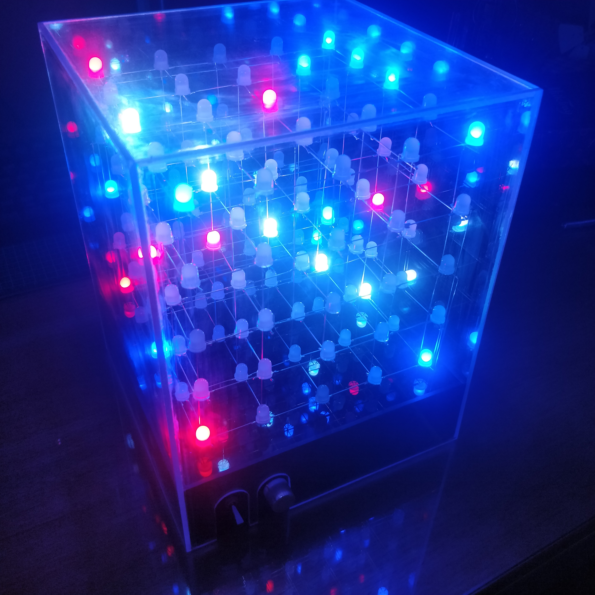

# Spacelines

A remake of the 1969 game from my grandparent's cupboard, on my LED cube. Spacelines is basically 3D naughts and crosses, in this case, on a 5x5x5 grid, requiring 5 in a row to win.

The cube contains 125 PL9823 RGB LEDs, and is controlled by an ESP8266 on which the code in this repo runs. Moves are entered on a simple webserver which by default runs on `cube.local`.

The LEDs are held in place only by the wires powering them, which was assembled layer by layer in a jig. The base and enclosure is made of 3 mm acrylic.